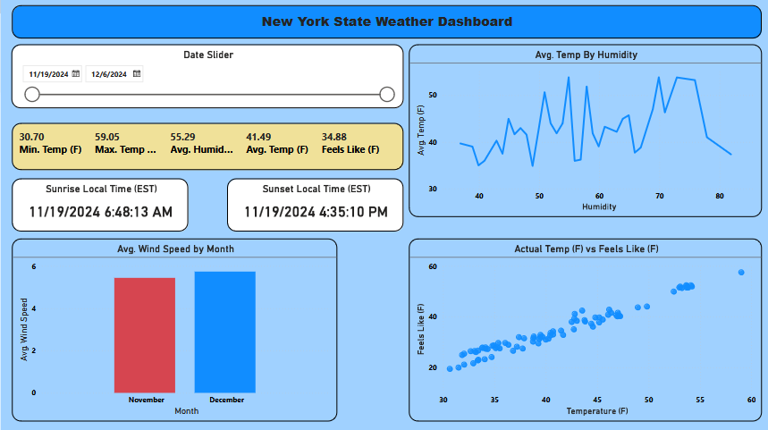

# openweathermap-etl
This ETL (Extract, Transform, Load) pipeline is designed to retrieve weather data from OpenWeatherMap API, process it, and create a comprehensive weather data analysis solution.

# Prerequisites

1. Python 3.12+
2. Apache Airflow
3. OpenWeatherMap API Key
4. AWS S3 Bucket
5. MySQL Database
6. Power BI Desktop

# Methodology:
1. Fetch Data from [OpenWeather API](https://openweathermap.org/current): Utilize the OpenWeather API to retrieve the necessary weather data for your analysis. This will serve as the primary data source for your ETL pipeline.
2. Analyze the Data Structure: Examine the data returned from the OpenWeather API to understand the schema, data types, and any relevant metadata that will inform your data processing.
3. Construct a mock production data lake in AWS S3: Create an S3 bucket and the necessary table schema to serve as the data source for your project.
4. Build an ETL Pipeline using Airflow:
   - Fetch the weather data from the OpenWeather API.
   - Run the `weather_dag.py` job on the downloaded data to produce a cleaned and processed dataset.
   - Store the final dataset in an AWS S3 bucket for further analysis.
5. Set up MySQL instance on Amazon RDS and make sure MySQL Workbench is setup on your computer
6. Configure AWS Glue and Crawlers
   - Utilize the AWS Glue service to automate the data cataloging and schema management tasks.
   - Set up Glue crawlers to discover and ingest the data stored in your S3 data lake.

7. Visualize in Power BI
   - Connect the processed data from the MySQL database to Power BI.

# Architecture Diagram
1. `OpenWeather API`: Primary data source for weather information
2. `Airflow`: Scheduling and orchestration of data pipeline workflows
3. `Amazon S3`: Data lake for storing raw, unprocessed weather data
4. `MySQL`: Data warehouse for structured and transformed weather data
5. `Power BI`: Data visualization and dashboard creation

# Dashboard Insights

1. Date Slider: The date slider allows you to view weather data for different dates, which is a useful feature for tracking changes over time.
2. Avg Temp By Humidity: This chart shows the relationship between average temperature and humidity levels. The fluctuations in the line graph indicate how these two factors vary together.
3. Sunrise and Sunset Local Times: Displaying the local sunrise and sunset times is helpful for understanding the daylight hours.
4. Avg Wind Speed by Month: This bar chart compares the average wind speeds between November and December, providing insight into seasonal wind patterns.
5. Actual Temp (F) vs Feels Like (F): The scatter plot visualizes the relationship between the actual temperature and the "feels like" temperature, which takes into account factors like wind and humidity.

# Future Enhancements

1. Machine learning weather prediction models
2. Real-time alerting for extreme weather conditions
3. Expand geographical coverage
4. Implement more advanced data visualization techniques