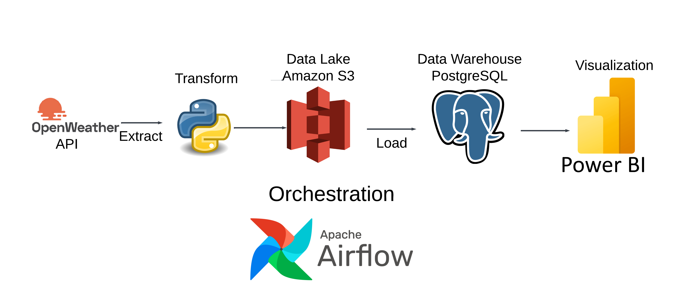

# openweathermap-etl

Steps to run:
Get API from https://openweathermap.org/api

# Architecture Diagram
1. `Airflow`: To schedule and orchestrate DAGs
2. `Amazon S3`: To act as our data lake and store raw data
3. `MySQL`: To act as our data warehouse
4. `Power BI`: To visualize the data in a dashboard

