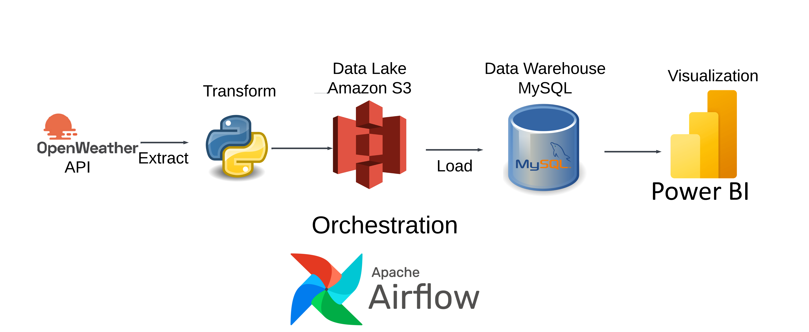

# openweathermap-etl

# Architecture Diagram
1. Airflow: To schedule and orchestrate DAGs
2. Amazon S3: To act as our data lake and store 
3. PostgreSQL: To act as our data warehouse
4. Power BI: To visualize the data in a dashboard

